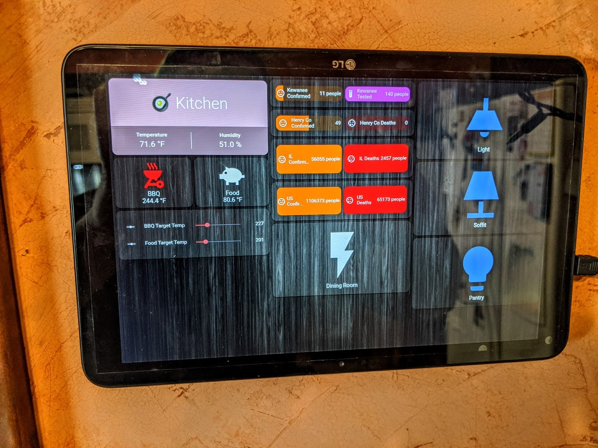
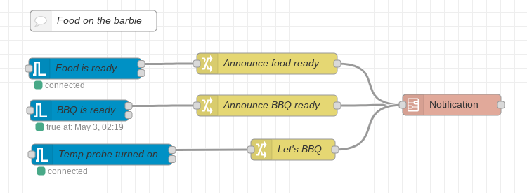

# HAMaverickTempProbe
Integrating a Maverick ET-732 temperature probe for use in Home Assistant

## Reading the temperature probe
The hardest part of this was getting the SDR to see the probe.  It was frustrating because this probe was listed as being supported.  Google was failing me, and then [this Issue](https://github.com/merbanan/rtl_433/issues/1360#issuecomment-621557516) popped up on the [rtl_433](https://github.com/merbanan/rtl_433) repository.  Apparently the ET-732 is just outside 433.92 MHz so my radio was not picking it up.  Changing the frequency to 433.776m makes it appear.  Be aware that this will make other things you may be monitoring drop out.  My LaCrosse temperature and humidity sensor still shows up, but the Acurite sensors from down the street do not.
```
Tuned to 433.776MHz.
_ _ _ _ _ _ _ _ _ _ _ _ _ _ _ _ _ _ _ _ _ _ _ _ _ _ _ _ _ _ _ _ _ _ _ _ _ _ _ _ _ _ _ _ _ _ _ _ _ _
time      : 2020-05-03 10:53:44
model     : Maverick-ET73x                         Session_ID: 14066
Status    : default      TemperatureSensor1: 21.00 C                         TemperatureSensor2: 174
.00 C
_ _ _ _ _ _ _ _ _ _ _ _ _ _ _ _ _ _ _ _ _ _ _ _ _ _ _ _ _ _ _ _ _ _ _ _ _ _ _ _ _ _ _ _ _ _ _ _ _ _
time      : 2020-05-03 10:53:44
model     : Maverick-ET73x                         Session_ID: 14066
Status    : default      TemperatureSensor1: 21.00 C                         TemperatureSensor2: 174
.00 C
_ _ _ _ _ _ _ _ _ _ _ _ _ _ _ _ _ _ _ _ _ _ _ _ _ _ _ _ _ _ _ _ _ _ _ _ _ _ _ _ _ _ _ _ _ _ _ _ _ _
time      : 2020-05-03 10:53:44
model     : Maverick-ET73x                         Session_ID: 14066
Status    : default      TemperatureSensor1: 21.00 C                         TemperatureSensor2: 174
.00 C
_ _ _ _ _ _ _ _ _ _ _ _ _ _ _ _ _ _ _ _ _ _ _ _ _ _ _ _ _ _ _ _ _ _ _ _ _ _ _ _ _ _ _ _ _ _ _ _ _ _
time      : 2020-05-03 10:53:44
model     : LaCrosse-TX141THBv2                    Sensor ID : 07
Channel   : 00           Temperature: 19.40 C      Humidity  : 35 %          Battery   : 1
Test?     : No
```

So after changing the frequency and making a modification to the rtl2mqtt script I was using, the temps start getting published to my MQTT server:
```
sensors/rtl_433/Maverick-ET73x/STATE {"time" : "2020-05-03 10:51:08", "model" : "Maverick-ET73x", "id" : 14066,
"status" : "default", "temperature1_C" : 21.000, "temperature2_C" : 158.000}

sensors/rtl_433/Maverick-ET73x/id 14066
sensors/rtl_433/Maverick-ET73x/temperature2_C 158.0
sensors/rtl_433/Maverick-ET73x/time 2020-05-03 10:51:08
sensors/rtl_433/Maverick-ET73x/temperature1_C 21.0
sensors/rtl_433/Maverick-ET73x/status default
```

I'm not positive where I got the script from, but it looks like an older version of (https://github.com/mverleun/RTL433-to-mqtt) I changed the JSON to be published to a STATE subtopic so I could use it, similar to what Tasmota does.

## Home Assistant Sensors
I wanted to know if the ET-732 was on, what each temperature was, and also if they had reached the desired temperatures, which I did by creating a sensor for each temperature, adding a couple input_numbers for my setpoints, and some template binary sensors.

Detecting if the ET-732 was on lets me use it as a condition to only make it appear on my dashboard if it's being used, plus now if I see it when I walk by, I'll remember I forgot to turn it off :)

I didn't know about `delay_on` and `delay_off` before this, but they are definitely useful so that the BBQ probe binary sensor doesn't keep bouncing on and off.

## Lovelace
The Lovelace configuration is pretty simple and uses (@RomRider)'s [Button Card](https://github.com/custom-cards/button-card) to show the temperatures and (@thomasloven)'s [Entity Slider Row](https://github.com/thomasloven/lovelace-slider-entity-row), both available in [HACS](https://hacs.xyz/)



## Node-RED
I do all my Google notifications through Node-Red, so I have a flow that monitors when the ET-732 turns on, when the BBQ reaches temperature, and when the food is done.  This is where the `delay_on` in the BBQ probe binary sensor comes in handy.  Throughout the first smoking time, Google kept telling us that the BBQ had reached temperature as it ebbed and flowed.  This was cute and funny until about Midnight...


